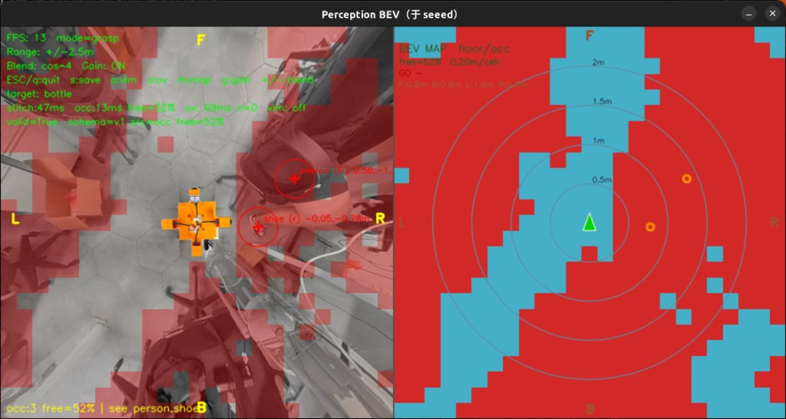

# Perception（BEV + 占用栅格 / YOLO-World）

本 demo 放在**带机械臂的底盘**上：YOLO-World 粗定位抓取目标，360° BEV 给臂看周围，占用图作避障 / 路线参考。



默认：**占用栅格**（直接吃拼接后的 BEV，不改标定）。  
grasp 默认：**YOLO-World v2 GPU FP16**（开放词汇多类框 → 真实 `x,y`）。加载权重时改走 CPU 拼接（画面不停），加载完恢复 CUDA。

```bash
# 首次：下 YOLO-World 权重
./scripts/download_perception_models.sh

# 只看占用栅格（右侧实时 2D 避障图，m 切换）
./scripts/run_perception.sh --vlm off --mode nav --range 2.5

# 夹取：YOLO-World GPU FP16 找矿泉水瓶
./scripts/run_perception.sh --mode grasp --target bottle

# 导航仍可用慢语义 VLM
./scripts/run_perception.sh --mode nav --range 2.5 --vlm qwen3vl-2b

./scripts/run_perception.sh --no-occ --vlm off   # 纯拼图
python3 -m perception.smoke_offline

# 车体图：俯拍裁成透明 PNG，叠到 BEV 中心（前朝上）
python3 scripts/make_ego_overlay.py assets/ego_chassis.png -o assets/ego_overlay.png
./scripts/run_perception.sh --mode grasp --target bottle
```

详见 [docs/PERCEPTION.md](../docs/PERCEPTION.md)。
